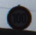
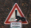
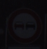

# Capstone 3 proposal

## **Option One** - Keeping it simple:

In 2011, the German Traffic Sign Detection Benchmark competition was held, asking participants to classify pictures of road signs. I have included a pdf about it in this directory. For my capstone, I would like to design a CNN architecture pipeline that can classify these signs. I would like to use the dataset from this competition to train a CNN model that does better than the winners (98.98%).

At first I thought this would be a really easy data set, but then I looked at the test data! It's full of images that are really difficult to classify like these: 

    [blurr](temp4.png) 

Ther's stickers and darkness and all matter of confusion that does not appear in the training data! And they are all like that. So, with an imported model, I'm getting 99.99% accuracy with the test data, and 7% accuracy with the test data. I think this will actually be a difficult problem to solve.

Maybe i can use the output from the base layer cnns to train a fifth cnn that classifies each photo based on which base layer cnn is most appropriate for it? IDK, room to explore. I'll focus on making things more complicated to get better results, and then simplifying to reduce complexity... rinse, spin, repeat.

The last step of my pipeline will be to add a 44th class (there are 43 casses of signs, and then I'll add one more for signs that the cnn is uncertain about.) My thought here is that self driving cars could make catestrophic (deadly) mistakes by mis-classifying signs. It would be much more advantageous to acknowledge when we are uncertain about what a sign is. This would allow the car to use other information sources. I.e., it is really easy for a car to simply slow down and adjust the cameras to get a better look at a hard to read sign. So why not? Because of this, I will only accept 100% accuracy, but will accept images that are classified as 'Unknown' as correct. With this in mind, it only makes sense to evaluate my models based on [what percentage of images must be classified as 'unknown' for it to give a 100% accuracy rating]. I like this a lot. The model that classifies the fewest number of 'unknown' images while still maintaining 100% accuracy is the best.

I really like this project idea because I am incredibly interested in self-driving cars. This is totally a direction I could go in for my career.

It also seems like a really complicated project is emerging from a really easy-to-use dataset, which will allow people to reproduce my results or fail trying.

## **Option Two** - Not so simple:

Like any proud father, I take lots of videos of my son. Many of these go up on a Whatsapp thread for all his grandparents to see. My son is 2.5 yo, so a lot of the recent videos are showcasing his emerging speaking ability. 

It's all fine and dandy, except for one thing. Because I am holding the camera and therefore closer to the microphone, my voice is always much louder than his. Many of the best videos are ruined by the fact that my voice prompting him to say things is so very much louder than when he actually says it!

It would be great to have a filter that reduces (or even removes) my voice from a video. I think this would also make a great capstone three project.

